# Single User Liveness Check Screen Flow

This document describes the flow and functionality of the Single User Liveness Check Screen using Mermaid diagrams.

## Main Flow Diagram

```mermaid
flowchart TD;
    A[Screen Initialize] --> B[Initialize Services]
    B --> C[Setup Camera]
    C --> D[Initialize Face Recognition Service]
    D --> E{Initialization Success?}
    
    E -->|No| F[Show Error Screen]
    F --> G[Go Back]
    
    E -->|Yes| H[Show Camera Preview]
    H --> I[Start Image Stream Processing]
    I --> J[Face Detection Loop]
    
    J --> K{Face Detected?}
    K -->|No| L[Show "Position Face" Instructions]
    L --> J
    
    K -->|Yes| M[Show Face Overlay]
    M --> N[Show "Start Check" Button]
    N --> O{User Starts Liveness Check?}
    
    O -->|No| J
    O -->|Yes| P[Begin Liveness Verification]
    
    P --> Q[Verify Face Recognition]
    Q --> R{Face Recognition Verified?}
    R -->|No| S[Show Verification Failed]
    S --> J
    
    R -->|Yes| T[Perform Liveness Checks]
    T --> U[Check Smile Detection]
    T --> V[Check Blink Detection]
    T --> W[Check Head Movement]
    T --> X[Check Face Consistency]
    
    U --> Y{All Checks Passed?}
    V --> Y
    W --> Y
    X --> Y
    
    Y -->|No| T
    Y -->|Yes| Z[Show Success State]
    Z --> AA[Auto Submit Attendance]
    AA --> BB[Navigate to Staff Management]
    
    style A fill:#e1f5fe
    style P fill:#fff3e0
    style Y fill:#e8f5e8
    style AA fill:#e8f5e8
    style F fill:#ffebee
```

## Liveness Check Process

```mermaid
flowchart TD;
    A[Start Liveness Check] --> B[Reset All Counters]
    B --> C[Begin Continuous Face Analysis]
    
    C --> D[Face Recognition Verification]
    D --> E{Current Face Matches Target User?}
    E -->|No| F[Stop Process - Identity Mismatch]
    E -->|Yes| G[Continue Liveness Tests]
    
    G --> H[Smile Detection Test]
    H --> I[Analyze ML Kit Smiling Probability]
    I --> J{Smile Probability > 0.7?}
    J -->|Yes| K[Increment Smile Counter]
    K --> L{Smile Count >= 3?}
    L -->|Yes| M[✅ Smile Test Passed]
    L -->|No| H
    J -->|No| H
    
    G --> N[Blink Detection Test]
    N --> O[Monitor Eye Open Probabilities]
    O --> P{Eyes Were Open & Now Closed?}
    P -->|Yes| Q[Increment Blink Counter]
    Q --> R{Blink Count >= 2?}
    R -->|Yes| S[✅ Blink Test Passed]
    R -->|No| N
    P -->|No| N
    
    G --> T[Head Movement Test]
    T --> U[Track Head Euler Angles]
    U --> V{Significant Head Movement Detected?}
    V -->|Yes| W[Increment Movement Counter]
    W --> X{Movement Count >= 1?}
    X -->|Yes| Y[✅ Head Movement Passed]
    X -->|No| T
    V -->|No| T
    
    G --> Z[Face Consistency Test]
    Z --> AA[Monitor Face Area Variance]
    AA --> BB{Face Area Variance > Threshold?}
    BB -->|Yes| CC[✅ Consistency Test Passed]
    BB -->|No| Z
    
    M --> DD{All Tests Completed?}
    S --> DD
    Y --> DD
    CC --> DD
    
    DD -->|No| C
    DD -->|Yes| EE[🎉 Liveness Check Passed]
    EE --> FF[Auto Submit After 2 Seconds]
    
    F --> GG[Show Error Message]
    
    style A fill:#e3f2fd
    style EE fill:#e8f5e8
    style M fill:#e8f5e8
    style S fill:#e8f5e8
    style Y fill:#e8f5e8
    style CC fill:#e8f5e8
    style F fill:#ffebee
    style GG fill:#ffebee
```



## Camera and Image Processing


## Anti-Spoofing Measures


## Error Handling


## User Interface States

The screen displays different UI components based on the current state:

1. **Loading State**: Shows initialization progress
2. **Ready State**: Camera preview with face detection overlay
3. **Liveness Check State**: Progress indicators for each test
4. **Success State**: Confirmation and auto-submission
5. **Error State**: Error details and recovery options

The interface provides real-time feedback on:
- Face detection status
- Individual liveness test progress
- Overall verification state
- Attendance submission status
